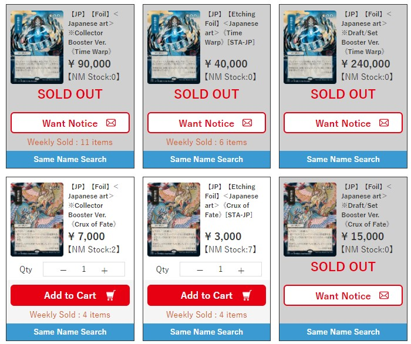
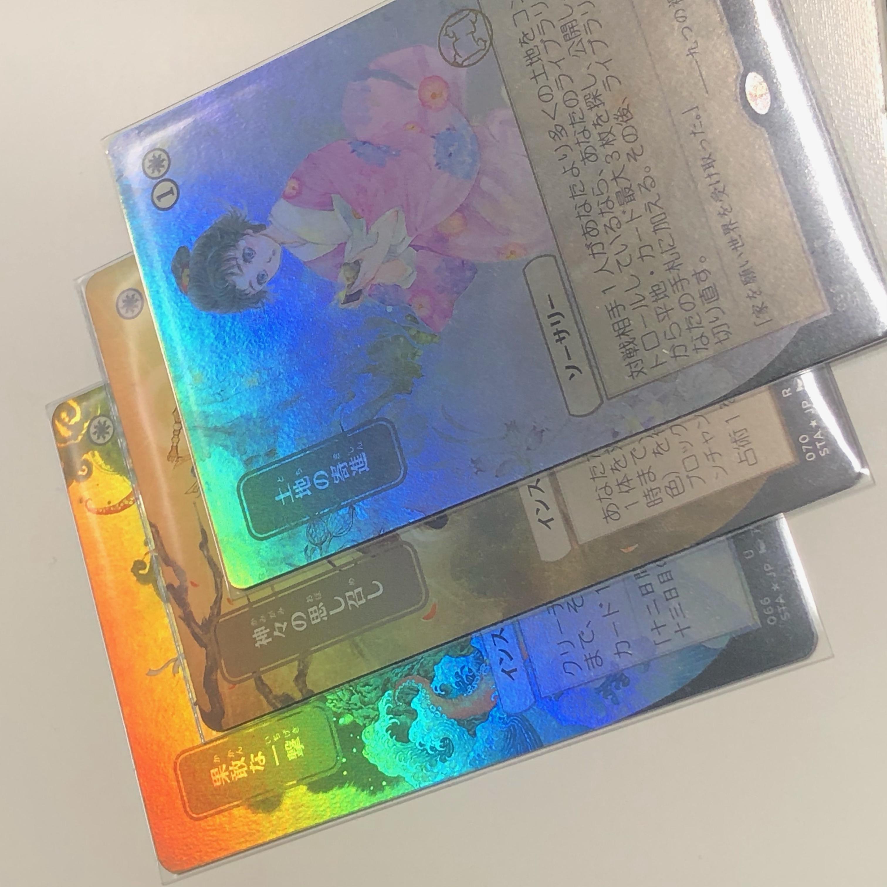

### Japanese Mystical Archive Set Foil vs Collector Booster (CB) Foil

Here is a little guide to help you understand the difference between a Japanese
Mystical Archive foil from a Collector Booster box and one from a Japanese Set Booster box.
The difference is very easy to spot once you have seen them in real life, especially
if you have one of each (more on that later).

The motivation of course is that there is likely to be much less Japanese Set Booster boxes,
plus since the pull rate for foils is much less compared to a CB box (sometimes there are none in a box),
we expect the set foils to carry a premium. 
Hareruya have priced this accordingly:

#### Rainbow effect (see the textbox)

In general the foiling in the set foils is more subtle while the foiling on the CB foils is the usual 'rainbow' foil. 
If you hit the cards with light at a certain angle, it is quite obvious as the picture below shows. The
middle card (God's Willing) is a set foil, and sandwiched between the two CB foils, it doesn't even look like
a foil in this picture.

See the following video as well (again, the set foil is God's Willing).

https://user-images.githubusercontent.com/5953262/116773144-ff4d3b80-aa96-11eb-92cb-34393f6b00ee.mov

It is most obvious on the textbox (the middle Lightning Bolt is the set foil):

https://user-images.githubusercontent.com/5953262/116773263-d24d5880-aa97-11eb-8751-788736517a92.mov

#### Rarity symbol

On the set foil, the rarity symbol has the rainbow effect, while the rest of the card is more subtle, so
they will pop out more compared to the rarity symbol in a CB foil. The rarity symbol in a CB foil does not
change colour that much, so 
if you can see a rainbow effect on
the rarity symbol, there's a good chance that it is a set foil. The following Lightning Bolt is
a set foil:

Here is the rainbow effect in action:

https://user-images.githubusercontent.com/5953262/116773230-94503480-aa97-11eb-806c-42f11d1d2b74.mov

Of course there is variance depending on the artwork, but generally it's difficult to see the uncommon (silver)
and gold (rare) rarity symbols on the CB foils, and the mythic (red) rarity symbol will hardly change.
You can see that in the following video, where Lightning Bolt (leftmost card) is again the set foil:

https://user-images.githubusercontent.com/5953262/116773509-f0678880-aa98-11eb-80e8-61f2ed0ae678.mov

#### Rounded Corner

This is actually the easiest method, but it only works if you have the physical card in front of you.
I don't think you will be able to tell this from a picture, 
unless you specifically ask for a closeup picture of the corner.
The set foil cards have rounded corner, as in, much more rounded compared to the CB foils, 
as you can see from the picture below (the card on the right is the set foil):

#### Texture

The next one is harder to spot, and it is not something I use to identify set or CB foils (the above is
more than enough for that), but more for a discussion. In my opinion, the foiling effect on the set foil is
much more smoother, and this to me feels like a new foil treatment. 

Here is a closeup of a CB foil:

and here is a closeup of the set foil:

You can see a bit more texture in the CB foil, which is how I expect foils to look. The foiling effect on the set foil
is more subtle, but it is also doing a much better job at preserving the original colours.

#### Does it matter?

The first time I saw the difference in these two foils, I immediately thought the set foil was much better, and
of course this is reflected by the price. However, I inspected these cards under a bright task lamp. 
Under normal circumstances (e.g. under sunlight), 
the difference is not as stark, and in fact the set foils are so subtle, they do not
even look like foils. 

If it bothers you so much, you can also use a matte sleeves on these cards. You can see the effect on the following
video. Both cards are CB foils, one of them inside an UltraPro matte sleeve.

https://user-images.githubusercontent.com/5953262/116773782-1726be80-aa9b-11eb-8d0c-cd456b32f81a.mov

You can see a massive difference as you insert them:

https://user-images.githubusercontent.com/5953262/116773793-2f96d900-aa9b-11eb-9d09-baae25ed1a3a.mov

I hope this has been helpful!

#### Bonus Content:

The etched-foil and non-foil versions of the Japanese MA cards are nearly identical apart from the obvious foiling 
on the textbox. However, if we compare them side by side, it becomes obvious that the etched-foils has a higher contrast
than the non-foils. In some art, this is more obvious than others. Here is a picture of Abundant Harvest etched and non-foil
side by side (the etched-foil is the left card):

The etched-foils also have a more rough texture if we look at it closely. Here is Opt, left is non-foil, right is etched. 
You can the difference in both colour and texture. 

And here is Mana Tithe, 

If you look closely with a loupe, the rosette pattern on the etched-foils is also different to what we normally see.
You can already see signs of this in the above pictures. 
